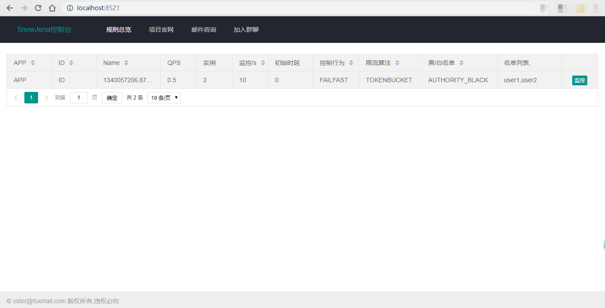
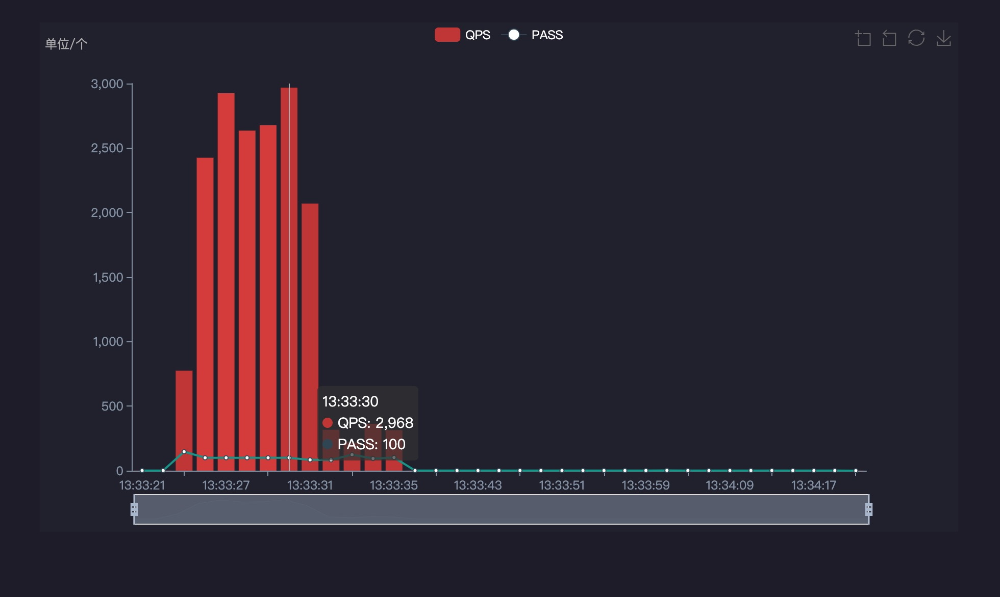

# SnowJena

## What

基于令牌桶算法和漏桶算法实现的纳秒级分布式无锁限流框架，支持熔断降级，支持流量塑型，支持动态配置规则，支持可视化监控，开箱即用。

A nanosecond distributed lock-free current limiting plug-in based on token bucket algorithm and leaky bucket algorithm, which supports fuse degradation, flow molding, dynamic configuration rules and visual monitoring, out of the box. 

## Document

使用文档：[中文](https://yueshutong.github.io/SnowJena/CN_README)|[English](https://yueshutong.github.io/SnowJena/EN_README)

## Noun

### 限流

当我们设计了一个函数，准备上线，这时候这个函数会消耗一些资源，处理上限是1秒服务3000个QPS，但如果实际情况遇到高于3000的QPS该如何解决呢？本项目提供了当QPS超出某个设定的阈值，系统可以通过直接拒绝或匀速器两种方式来应对，从而起流量控制的作用。

### 降级

接触过Spring Cloud、Service Mesh的同学，都知道熔断降级的概念。服务之间会有相互依赖关系，例如服务A做到了1秒上万个QPS，但这时候服务B并无法满足1秒上万个QPS，那么如何保证服务A在高频调用服务B时，服务B仍能正常工作呢？一种比较常见的情况是，服务A调用服务B时，服务B因无法满足高频调用出现响应时间过长的情况，导致服务A也出现响应过长的情况，进而产生连锁反应影响整个依赖链上的所有应用，这时候就需要熔断和降级的方法。本项目通过设置快速失败策略来对服务进行熔断或降级。

### 塑形

通常我们遇到的流量具有随机性、不规则、不受控的特点，但系统的处理能力往往是有限的，我们需要根据系统的处理能力对流量进行塑形，即规则化，从而根据我们的需要来处理流量。本项目原生自带流量塑性功能，严格控制系统的处理时间间隔。

### 负载保护

平时系统运行都没问题，但遇到大促的时候，发现机器的load非常高，这时候对系统的负载保护就显得非常重要，以防止雪崩。本项目提供了对应的保护机制，让系统的入口流量和系统的负载达到一个平衡，保证系统在能力范围之内处理最多的请求。需要注意的是，本项目在系统负载保护方面的机制是根据匀速器来做流量塑性，使系统能够处理的请求，和允许进来的请求，达到平衡。

## Preview

## About

Blog：[https://www.yueshutong.cn](https://www.yueshutong.cn/)

Email：[yster@foxmail.com](mailto:yster@foxmail.com)

Github：<https://github.com/yueshutong/SnowJena>

Gitee：<https://gitee.com/zyzpp/SnowJena>

交流QQ群：781927207

如果帮助到你了，请不吝赞赏！如果贵司或团队使用了本限流插件，欢迎在 Issues 留言，我会在底部链接贵司的主页，谢谢！

