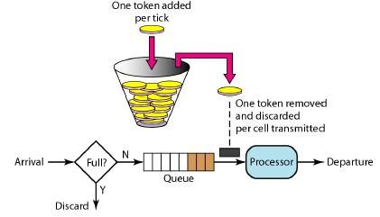

## 1.简介

spring-boot-starter-current-limiting：完美嵌入SpringBoot应用的**无锁限流**插件，支持方法级别、系统级别限流，支持设置系统启动保护时间，提供快速失败与CAS阻塞两种限流方案，这些功能只需要导入依赖，简单配置即可使用。


## 2.Maven

```xml
<dependency>
  <groupId>cn.yueshutong</groupId>
  <artifactId>spring-boot-starter-current-limiting</artifactId>
  <version>0.0.1.RELEASE</version>
</dependency>
```

## 3.方法限流

在需要限流的方法上使用 @CurrentLimiter 注解，示例代码如下：

```java
@RestController
public class MyController {

    @RequestMapping("/hello")
    @CurrentLimiter(QPS = 2)
    public String hello(){
        return "hello";
    }

}
```

@CurrentLimiter 注解参数说明：

| 属性         | 说明         | 默认值 |
| ------------ | ------------ | ------ |
| QPS          | 每秒并发量   | 20     |
| initialDelay | 初始延迟时间 | 0      |
| failFast     | 开启快速失败 | true   |

## 4.系统限流

对整个应用的限流只需要在配置文件中配置即可，示例代码如下：

```properties
current.limiting.enabled=true
current.limiting.part-enabled=false
current.limiting.qps=100
current.limiting.fail-fast=true
current.limiting.initial-delay=0
```

参数说明：

| 属性          | 说明         | 默认值 |
| ------------- | ------------ | ------ |
| enabled       | 开启全局限流 | false  |
| part-enabled  | 开启注解限流 | true   |
| qps           | 每秒并发量   | 100    |
| fail-fast     | 开启快速失败 | true   |
| initial-delay | 初始延迟时间 | 0      |

## 5.拒绝策略

提供快速失败与CAS阻塞两种限流方案。如果是阻塞则不需要拒绝策略，当获取到令牌后依旧会继续执行，可以当做一种限制速率的措施。这里只讨论快速失败的拒绝策略。

快速失败的默认策略是统一返回“服务不可用”的英文说明文字，如果用户需要自定义拒绝策略，提供两种接口供实现。

针对被注解的方法进行自定义拒绝策略是实现CurrentAspectHandler接口，示例代码：

```java
@Component
public class MyAspectHandler implements CurrentAspectHandler {
    @Override
    public Object around(ProceedingJoinPoint pjp, CurrentLimiter rateLimiter) throws Throwable {
        //被注解修饰的方法返回值，慎用！
        //可以结合Controller返回自定义视图
        return "fail";
    }
}
```

针对系统级别的拒绝策略是实现CurrentInterceptorHandler接口，示例代码：

```java
@Component
public class MyInterceptorHandler implements CurrentInterceptorHandler {
    @Override
    public void preHandle(HttpServletRequest request, HttpServletResponse response, Object handler) throws Exception {
        response.getWriter().print("fail");
    }

}
```

## 6.关于作者

博客：[http://www.yueshutong.cn](http://www.yueshutong.cn/)

邮箱：[yster@foxmail.com](mailto:yster@foxmail.com)

Github：<https://github.com/yueshutong/spring-boot-starter-current-limiting>

Gitee：<https://gitee.com/zyzpp/spring-boot-starter-current-limiting>

交流QQ群：781927207

## 7.限流算法

### 1）漏桶算法

漏桶(Leaky Bucket)算法思路很简单，水（请求）先进入到漏桶里，漏桶以一定的速度出水（接口有响应速率），当水流入速度过大会直接溢出（访问频率超过接口响应速率），然后就拒绝请求，可以看出漏桶算法能强行限制数据的传输速率。示意图如下：

 

### 2）令牌桶算法

令牌桶算法（Token Bucket）和 Leaky Bucket 效果一样但方向相反的算法，更加容易理解。随着时间流逝，系统会按恒定1/QPS时间间隔（如果QPS=100，则间隔是10ms）往桶里加入Token（想象和漏洞漏水相反，有个水龙头在不断的加水），如果桶已经满了就不再加了。新请求来临时，会各自拿走一个Token，如果没有Token可拿了就阻塞或者拒绝服务。示意图如下：

 

漏桶算法与令牌桶算法的区别在于，漏桶算法能够强行限制数据的传输速率，令牌桶算法能够在限制数据的平均传输速率的同时还允许某种程度的突发传输。令牌桶的另外一个好处是可以方便的改变速度。 一旦需要提高速率，则按需提高放入桶中的令牌的速率。一般会定时（比如100毫秒）往桶中增加一定数量的令牌, 有些变种算法则实时的计算应该增加的令牌的数量。
