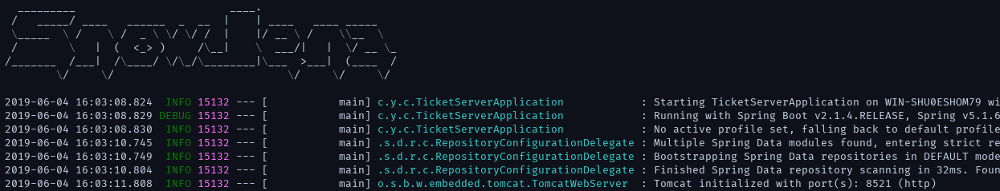
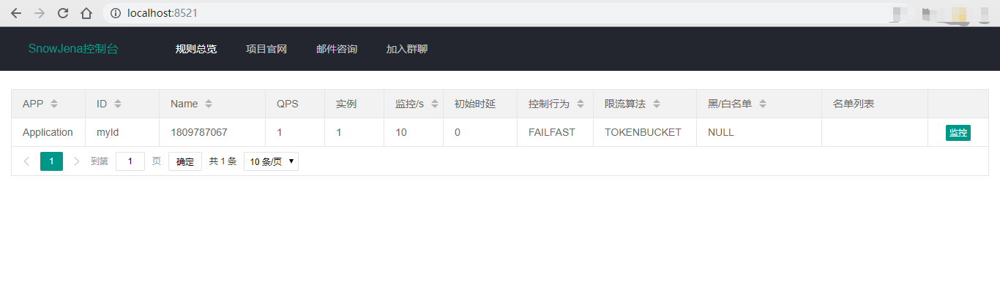
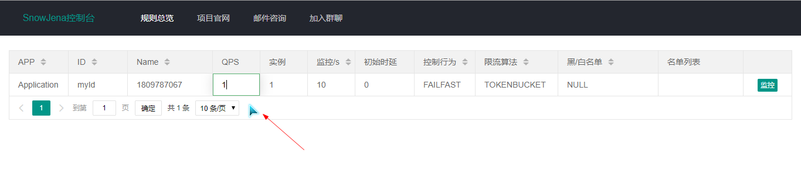
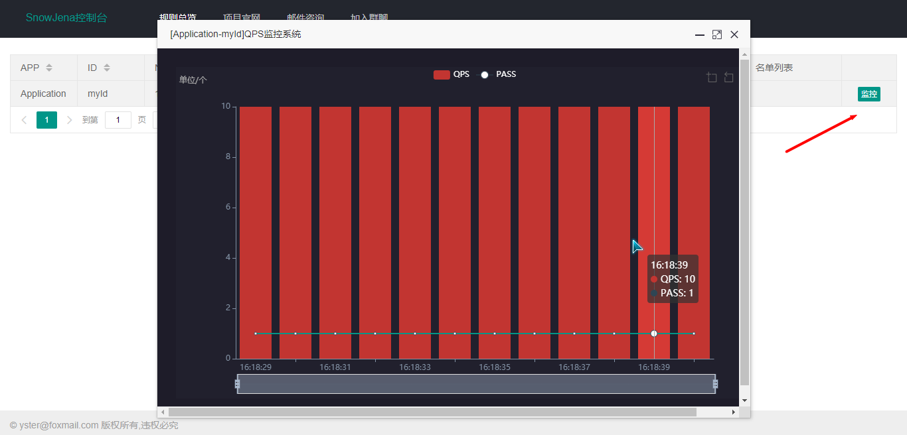

# SnowJean使用文档

## Maven

```xml
<dependency>
  <groupId>cn.yueshutong</groupId>
  <artifactId>snowjena-core</artifactId>
  <version>1.0.0.RELEASE</version>
</dependency>
```

## 单点限流

本项目提供了简单易用的API，对于单点限流，只需要通过工厂模式生产限流器，在需要限流的代码运行之前调用tryAcquire()方法即可。

```java
public class AppTest {
    Logger logger = LoggerFactory.getLogger(getClass());

    @Test
    public void test1(){
        // 1.配置规则
        LimiterRule limiterRule = new LimiterRule();
        limiterRule.setQps(1); //每秒并发量
        // 2.工厂模式生产限流器
        RateLimiter limiter = RateLimiterFactory.of(limiterRule);
        // 3.使用
        while (true){
            if (limiter.tryAcquire()){
                logger.info("ok");
            }
        }
    }

}
```

查看控制台打印

```verilog
15:10:06.670 [main] INFO com.example.springbootdemo.AppTest - ok
15:10:07.651 [main] INFO com.example.springbootdemo.AppTest - ok
15:10:08.653 [main] INFO com.example.springbootdemo.AppTest - ok
15:10:09.652 [main] INFO com.example.springbootdemo.AppTest - ok
```

## 黑白名单

黑白名单功能为：对黑名单不允许通过，或只对白名单允许通过（二选一）。

```java
public class AppTest {
    Logger logger = LoggerFactory.getLogger(getClass());

    /**
     * 黑白名单
     */
    @Test
    public void test2(){
        // 1.配置规则
        LimiterRule limiterRule = new LimiterRule();
        limiterRule.setQps(1);
        limiterRule.setRuleAuthority(RuleAuthority.AUTHORITY_BLACK);//黑名单
        limiterRule.setLimitApp(new String[]{"user1","user2"});//黑名单列表
        // 2.工厂模式生产限流器
        RateLimiter limiter = RateLimiterFactory.of(limiterRule);
        // 3.使用
        while (true){
            if (limiter.tryAcquire("user1")){
                logger.info("user1");
            }
            if (limiter.tryAcquire("user2")){
                logger.info("user2");
            }
            if (limiter.tryAcquire("user3")){
                logger.info("user3");
            }
        }
    }
    
}
```

查看控制台打印

```verilog
15:19:22.506 [main] INFO com.example.springbootdemo.AppTest - user3
15:19:23.522 [main] INFO com.example.springbootdemo.AppTest - user3
15:19:24.484 [main] INFO com.example.springbootdemo.AppTest - user3
```

## 分布式限流

分布式限流功能相比单点限流更为强大，支持熔断降级，支持流量塑型，支持动态配置规则，支持可视化监控，开箱即用。 

使用之前你需要：

1. 启动Redis

   本示例默认在本地开启了Redis，默认端口6379，无密码。

2. 启动TicketServer

   下载 TicketServer.jar 包，运行，默认端口8521。

启动 TicketServer 后的界面：

客户端代码：

```java
public class AppTest {
    Logger logger = LoggerFactory.getLogger(getClass());

    /**
     * 分布式限流
     */
    @Test
    public void test4() {
        // 1.限流配置
        LimiterRule limiterRule = new LimiterRule();
        limiterRule.setApp("Application"); //应用名
        limiterRule.setId("myId"); //限流器ID
        limiterRule.setQps(1);
        limiterRule.setLimiterModel(LimiterModel.CLOUD); //分布式限流,需启动TicketServer控制台
        // 2.配置TicketServer地址（支持集群、加权重）
        Map<String,Integer> map = new HashMap<>();
        map.put("127.0.0.1:8521",1);
        // 3.全局配置
        RateLimiterConfig config = RateLimiterConfig.getInstance();
        config.setTicketServer(map);
        // 4.工厂模式生产限流器
        RateLimiter limiter = RateLimiterFactory.of(limiterRule, config);
        // 5.使用
        while (true) {
            if (limiter.tryAcquire()) {
                logger.info("ok");
            }
        }
    }
        
}
```

查看控制台打印

```verilog
16:07:08.694 [main] INFO com.example.springbootdemo.AppTest - ok
16:07:09.660 [main] INFO com.example.springbootdemo.AppTest - ok
16:07:10.643 [main] INFO com.example.springbootdemo.AppTest - ok
```

## 监控图表

此时打开你的浏览器，访问 localhost:8521，可以看到控制台视图



你可以实时修改QPS，控制行为，限流算法，黑白名单，需要注意的是，名单列表以英文,逗号分隔。



你也可以通过监控视图，在线查看系统负载情况。（QPS：收到的请求，PASS：允许的请求）




## 限流规则

上面简要提到了一些功能，下面详细说明下 LimiterRule 限流规则。

| 参数          | 说明                      |
| ------------- | ------------------------- |
| initialDelay  | 初始时延                  |
| acquireModel  | 控制行为：快速失败/匀速器 |
| algorithm     | 算法：令牌桶/漏桶         |
| limiterModel  | 部署方式：单点/分布式     |
| ruleAuthority | 黑名单/白名单/无          |
| limitApp      | 黑白名单列表              |

> 文档不断完善，请提交Issues。